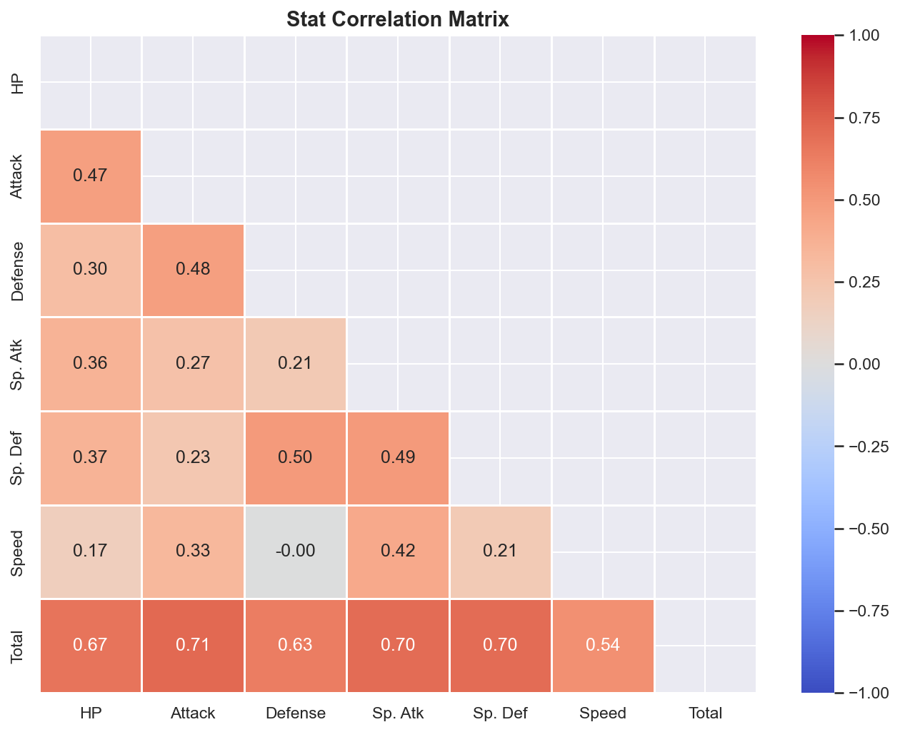
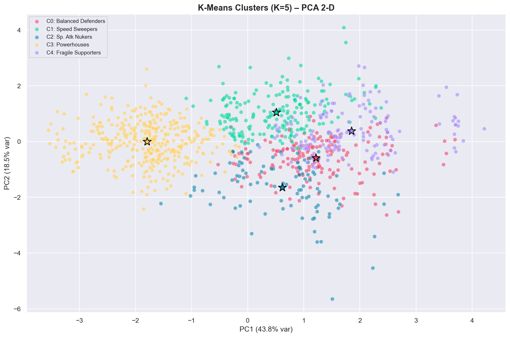
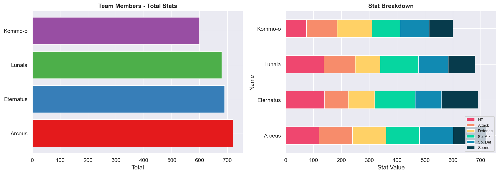

# Pokémon Data Showdown


Pokémon Data Showdown is an interactive data analysis toolkit and dashboard designed to explore the structure of Pokémon battle attributes. It leverages machine learning to uncover stat-based roles, provides deep exploratory data analysis (EDA), and includes an optimized team builder constrained by statistical budgets.

## Features

* **Exploratory Data Analysis (EDA):** Interactive distributions, heatmaps, and stat profiles to uncover real Pokémon game design trends and power creep across generations.
  
  

* **K-Means Clustering:** Unsupervised machine learning models projecting Pokémon stats across dynamic PCA coordinates to cluster them into functional roles like "Speed Sweepers" and "Fragile Supporters."
  
  

* **Optimal Team Builder:** A mathematically constrained algorithm that produces perfect 6-Pokémon teams matching specific budget allocations (like exactly 2700 max Total stats).

  

* **Pokédex Explorer:** Interactive searching and stat profile tracking for deep-diving into individual Pokémon.

## Technology Stack

* **Python 3**
* **Streamlit:** For the interactive web application UI.
* **Plotly:** For rendering rich, dark-mode 2D and 3D data visualizations and radar charts.
* **Scikit-Learn:** Used for K-Means Clustering, PCA projection, and Silhouette scoring.
* **Pandas & NumPy:** For data filtering, manipulation, and algorithm sorting.
* **Jupyter Notebooks:** Provided via `pokemon_analysis.ipynb` for offline data insights.

## Running the Project Locally

### 1. Requirements

Make sure you have python installed along with the packages located in `requirements.txt`:
```bash
pip install -r requirements.txt
```

### 2. Launching the App

To run the full Streamlit dashboard on your local machine, run the following command in your terminal natively on Windows:

```bash
python -m streamlit run app.py
```

The application will launch on `http://localhost:8502` by default.

### 3. Jupyter Notebook Analysis

For a breakdown of individual data insights, you can run the Jupyter Notebook:
```bash
jupyter notebook pokemon_analysis.ipynb
```

## Design Philosophy 

The dashboard UI was strictly customized with advanced vanilla CSS to ensure a beautiful, dynamic, and premium presentation matching modern aesthetic standards with purple/blue dark-mode styling, glassmorphism, and responsive rendering. 
